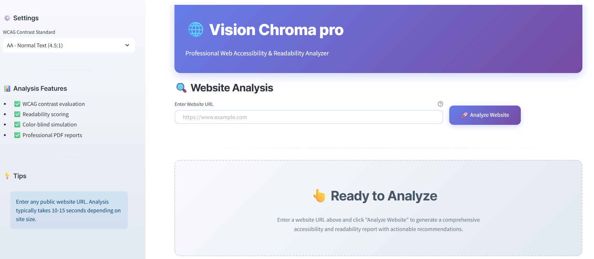
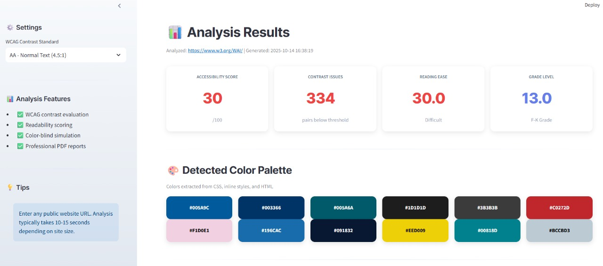
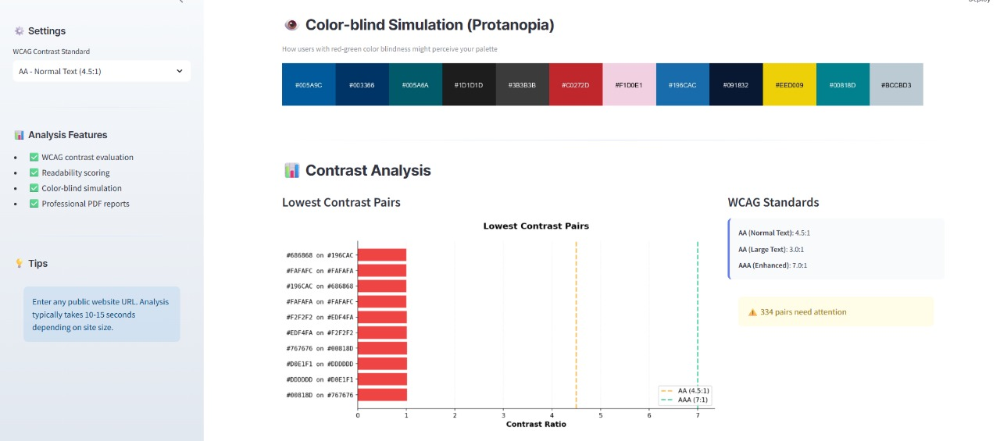
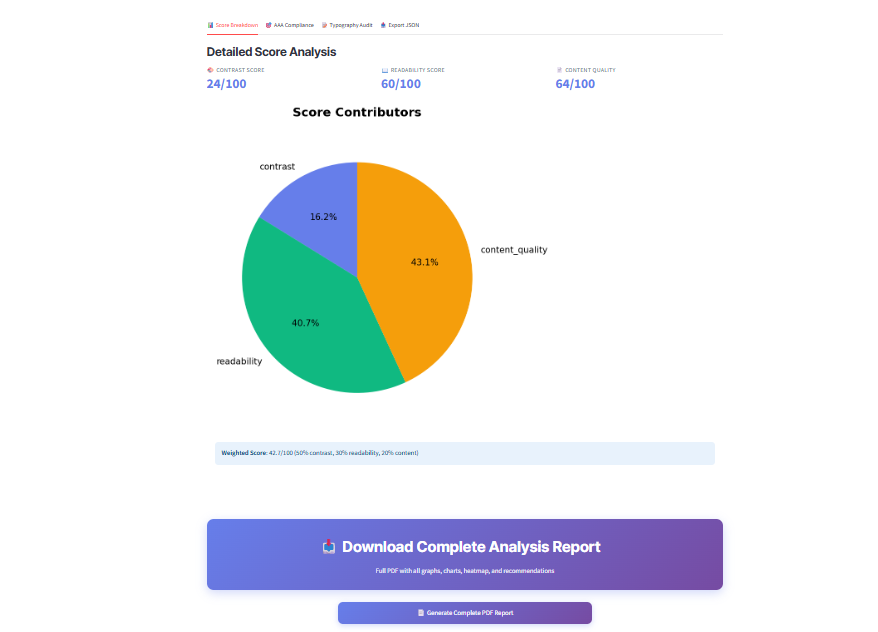
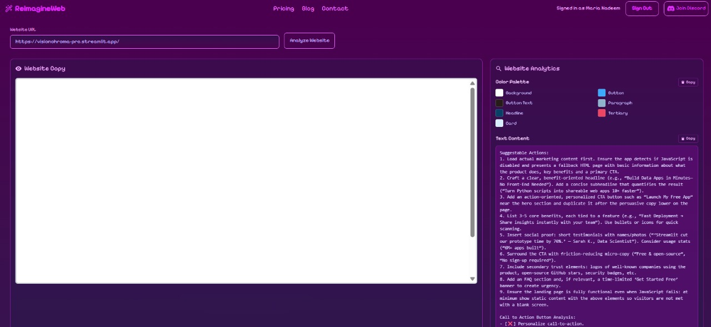

# Vision Chroma pro

## Overview

Vision Chroma pro is a  web accessibility and readability analyzer which evaluates websites for WCAG compliance, color contrast issues, and content readability. It provides detailed reports, visual analytics, and actionable recommendations to improve digital accessibility


## Features

### Core Accessibility Features

**1. Color Extraction & Analysis**
- Automatic extraction of color palettes from CSS, inline styles, and linked stylesheets
- Normalization of color values
- Detection of theme colors from meta tags

**2. WCAG Contrast Compliance**
- Pixel-perfect contrast ratio calculations based on WCAG 2.1 standards
- Evaluation against three compliance levels: AA (4.5:1), AA Large (3.0:1), AAA (7.0:1)
- Detailed identification of failing color pairs
- Visualization of lowest contrast combinations

**3. Color-Blind Simulation**
- Real-time simulation of three color vision deficiency types:
  - Protanopia 
  - Deuteranopia 
  - Tritanopia
- Dual simulation modes: advanced (colorspacious library) and fallback (matrix-based)

**4. Readability Assessment**
- Flesch Reading Ease scoring (0-100 scale)
- Flesch-Kincaid Grade Level calculation
- Content complexity analysis
- Typography hierarchy evaluation
- Sentence and paragraph structure assessment

**5. User Attention Heatmap**
- Estimated user focus distribution across page zones
- Grid-based layout analysis 
- Weighted scoring based on interactive elements
- Visual representation of high/low attention areas

**6. Typography Analysis**
- Heading hierarchy validation 
- Font size usage patterns
- Typography consistency scoring
- Font family extraction and normalization


## System Architecture

### High-Level Architecture Diagram

```
┌──────────────────────────────────────────────────────────────┐
│                    STREAMLIT UI LAYER                        │
│          (Web Interface & User Interaction)                  │
└────────────────────────┬─────────────────────────────────────┘
                         │
        ┌────────────────┼────────────────┐
        │                │                │
        ▼                ▼                ▼
   ┌─────────────┐ ┌──────────────┐ ┌──────────────┐
   │   INPUT     │ │  PROCESSING  │ │   OUTPUT     │
   │  VALIDATION │ │   ENGINE     │ │  GENERATION  │
   └─────────────┘ └──────────────┘ └──────────────┘
        │                │                │
        │                │                │
        ▼                ▼                ▼
   ┌──────────────────────────────────────────────────┐
   │      CORE ANALYSIS MODULES (modules/ folder)     │
   │                                                  │
   │  • Color Extraction & Normalization              │
   │  • Contrast Calculation Engine                   │
   │  • Readability Scoring                           │
   │  • Colorblind Simulation                         │
   │  • Heatmap Generation                            │
   │  • Typography Audit                              │
   │  • WCAG Compliance Checker                       │
   └──────────────────────────────────────────────────┘
        │
        ▼
   ┌──────────────────────────────────────────────────┐
   │       DATA VISUALIZATION & EXPORT LAYER          │
   │                                                  │
   │  • Chart Generation (Matplotlib, Seaborn)        │
   │  • PDF Report Compilation (ReportLab)            │
   │  • JSON Export for CI/CD                         │
   │  • Image Processing & Rendering                  │
   └──────────────────────────────────────────────────┘
```

### Data Flow Pipeline

```
Website URL Input
       │
       ▼
┌──────────────────────┐
│ 1. URL Validation    │ → Validate format & accessibility
└──────────────────────┘
       │
       ▼
┌──────────────────────┐
│ 2. Content Fetch     │ → requests library + retry logic
└──────────────────────┘
       │
       ▼
┌──────────────────────────────────────────┐
│ 3. HTML Parsing & Processing             │
│                                          │
│ • Extract color palette (CSS + inline)   │
│ • Extract text content (semantic tags)   │
│ • Extract images & buttons               │
│ • Identify interactive elements          │
└──────────────────────────────────────────┘
       │
       ▼
┌──────────────────────────────────────────┐
│ 4. Analysis Engine                       │
│                                          │
│ • Contrast ratio calculation (all pairs) │
│ • Readability metrics (textstat)         │
│ • Typography scoring                     │
│ • Accessibility evaluation               │
└──────────────────────────────────────────┘
       │
       ▼
┌──────────────────────────────────────────┐
│ 5. Visualization & Report Generation     │
│                                          │
│ • Charts & graphs (Matplotlib)           │
│ • Heatmap rendering (Seaborn)            │
│ • PDF compilation (ReportLab)            │
│ • JSON export (Python json)              │
└──────────────────────────────────────────┘
       │
       ▼
Display Results & Generate Artifacts
```

---

## Project Structure

```
VisionChroma-pro/
├── app.py
├── main.py                          # Main entry point of your application
│
├── modules/                         # Modules folder
│   ├── __init__.py
│   ├── accessibility_check.py
│   ├── accessibility_enhancements.py
│   ├── colorblind_simulator.py
│   ├── features_extension.py
│   ├── heatmap_generator.py
│   ├── pdf_report_complete.py
│   ├── readability_check.py
│   ├── report_generator.py
│   └── web_scraper.py
│
└── requirements.txt
```

---

## Technology Stack

### Frontend
- **Streamlit** : Web UI framework
- **HTML/CSS** : Custom styling and responsive design
- **JavaScript** (embedded) : Enhanced interactivity

### Backend Processing
- **Python** : Core language
- **BeautifulSoup** : HTML parsing and DOM traversal
- **Requests** : HTTP client with retry logic

### Data Analysis & Visualization
- **Matplotlib** : Chart generation (contrast analysis, score breakdown)
- **Seaborn** : Statistical visualizations (heatmaps)
- **Pandas** : Data manipulation and analysis
- **NumPy** : Numerical computations

### Accessibility & Color Science
- **Textstat** : Readability metrics (Flesch, Flesch-Kincaid)
- **Colorspacious** : Advanced color space transformations
- **CSSUtils** : CSS parsing and analysis
- **PIL/Pillow** : Image processing

## Installation & Setup


### Step 1: Clone Repository
```bash
git clone https://github.com/yourusername/colorsync-access.git
cd colorsync-access
```

### Step 2: Create Virtual Environment
```bash
python -m venv venv
source venv/bin/activate  # On Windows: venv\Scripts\activate
```

### Step 3: Install Dependencies
```bash
pip install -r requirements.txt
```

### Step 4: Run Application
```bash
streamlit run app.py
```

The application will be available at `http://localhost:8501`

## Live Demo

Get a quick visual overview of ColorSync Access in action:

### Dashboard Overview

*Main analysis dashboard*

### Contrast Analysis

*Detailed contrast ratio analysis with WCAG compliance indicators*

### ColorBlind Contrast Analysis

*Detailed contrast ratio analysis with WCAG compliance indicators*

### Download Report

*Comprehensive PDF report with charts, recommendations, and action items*

### ReimagineWeb Analysis

*AI-powered website analysis from ReimagineWeb showing color palette, contrast analytics, and improvement suggestions for VisionChroma-pro*


## Usage Guide

### Basic Workflow

**1. Launch Application**
```
streamlit run app.py
```

**2. Enter Website URL**
- Input box accepts fully qualified URLs (https://example.com)
- Validates format and accessibility before analysis

**3. Configure Analysis Settings**
- Select WCAG standard (AA Normal 4.5:1, AA Large 3.0:1, AAA 7.0:1)
- View analysis features in sidebar

**4. Analyze Website**
- Click "Analyze Website" button
- Progress bar shows analysis stages:
  - Fetching content 
  - Extracting colors 
  - Analyzing text 
  - Evaluating accessibility 
  - Generating reports 
  - Complete 

**5. Review Results**
- Key metrics dashboard 
- Color palette visualization
- Contrast analysis charts
- Color-blind simulations
- User attention heatmap
- Score breakdowns
- AAA compliance status
- Typography audit
- JSON export for CI/CD

**6. Generate Reports**
- Click "Generate Complete PDF Report"
- Downloads comprehensive document
- Includes all visualizations and recommendations

### Advanced Features

**Sidebar Configuration**
- Adjust WCAG compliance threshold
- View analysis feature checklist
- Access helpful tips

**Multiple Analysis Modes**
- Compare different websites
- Track changes over time
- Batch analysis 

## Output & Reports

### Interactive Dashboard
**Real-time display includes**:
- 4-metric key performance card grid
- Color palette swatches 
- Contrast analysis bar chart
- Color-blind simulation (Protanopia)
- User attention heatmap
- Score breakdown pie chart
- AAA compliance status
- Typography metrics
- Actionable recommendations (tabbed)

### PDF Report 
**Page Breakdown**:
1. Title, URL, Key Metrics Table
2. Color Palette Swatches & List
3. Contrast Analysis Chart & Top 10 Issues Table
4. Color-Blind Simulation (Protanopia)
5. User Attention Heatmap
6. Score Breakdown Pie Chart (Contrast/Readability/Content)
7. AAA Compliance Bar Chart
8. Typography Metrics Chart
9. Readability Details & Content Analysis
10-11. Complete Recommendations (Prioritized)
12. WCAG Guidelines & Implementation Checklist
13. Action Plan & Resources

### Core Team

**[Maria Nadeem]**  
GitHub: [marianadeem](https://github.com/marianadeem755)

**[Mehak Iftikhar]**  
GitHub: [mehakiftikhar](https://github.com/mehakiftikhar)

**[Sana Adeel]**  
GitHub: [sanaadeel](https://github.com/SanaAdeelKhan)

**[Ali jafar]**  
GitHub: [alijafar](https://github.com/alijafarkamal)

## Acknowledgments

- WCAG 2.1 Guidelines by W3C
- BeautifulSoup by Leonard Richardson
- Streamlit by Streamlit Inc.
- ReportLab for PDF generation
- Matplotlib/Seaborn for visualization
